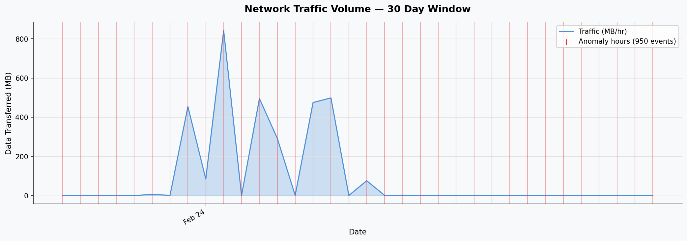
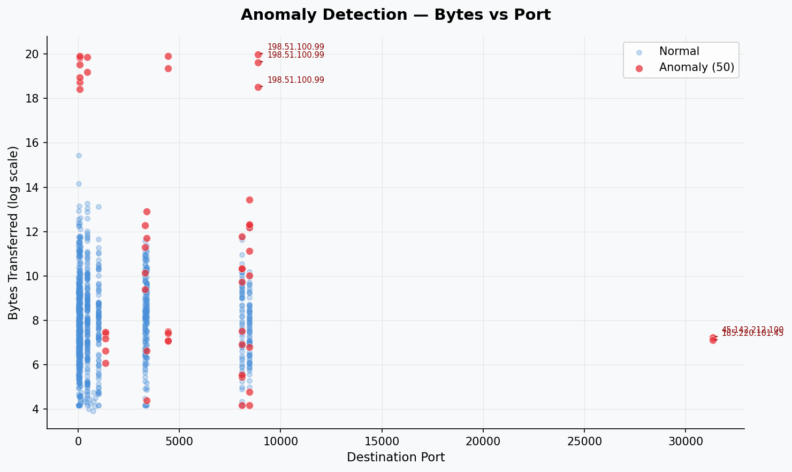
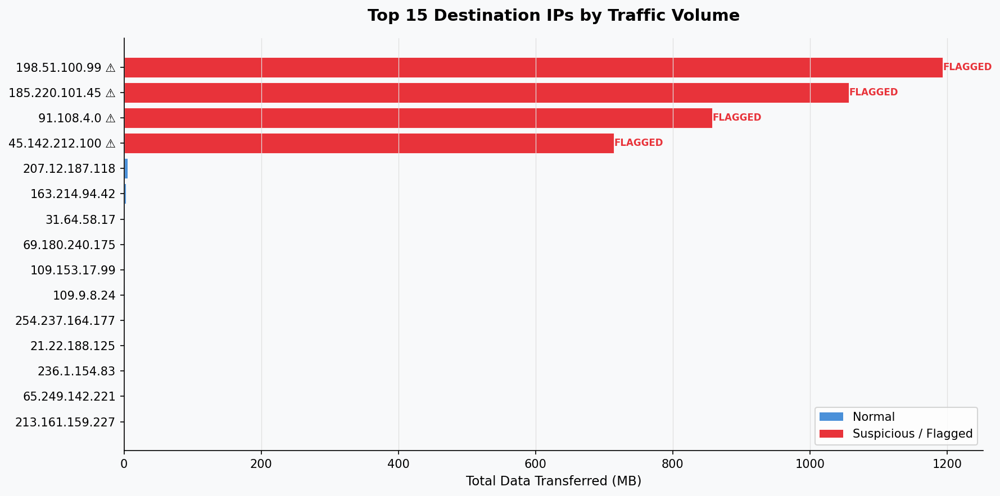

# Network Security Analytics Tool


An end-to-end network traffic analysis tool that uses **unsupervised machine learning** to detect anomalous behavior in network logs — without requiring labeled training data.

Built from scratch in Python: log ingestion → cleaning → feature engineering → Isolation Forest anomaly detection → dashboard visualization.

---

## Features

- **Custom Isolation Forest** — implemented in pure NumPy (no sklearn dependency), demonstrating understanding of the algorithm rather than black-box usage
- **Realistic log generator** — generates synthetic network traffic with injected anomalies (port scans, data exfiltration, C2 beacons) for demo/testing
- **Threat intel matching** — flags connections to known-bad IPs against a configurable threat feed
- **Three chart outputs** — traffic timeline, anomaly scatter plot, top IPs by volume
- **Console threat report** — ranked anomaly events with byte counts and IP flagging
- **CI/CD pipeline** — GitHub Actions tests across Python 3.9, 3.10, 3.11

---

## Sample Output

### Traffic Over Time (with anomaly markers)


### Anomaly Detection — Bytes vs Port


### Top Destination IPs (suspicious IPs flagged)


---

## Quick Start

```bash
# Clone
git clone https://github.com/duckcoop/network-security-analytics.git
cd network-security-analytics

# Install dependencies
pip install -r requirements.txt

# Run (auto-generates sample data if no CSV provided)
python analyzer.py

# Or analyze your own log file
python analyzer.py --input /path/to/your/logs.csv
```

---

## How It Works

### 1. Log Ingestion & Cleaning (`analyzer.py`)
Loads CSV log data, parses timestamps, handles missing fields, and validates value ranges.

### 2. Feature Engineering
Extracts numeric features from raw logs:
| Feature | Description |
|---|---|
| `log_bytes` | Log-scaled bytes transferred |
| `dest_port` | Destination port number |
| `hour` | Hour of day (0–23) |
| `is_suspicious_dest` | Match against threat intel feed |
| `is_deny` | Firewall deny status |
| `is_high_port` | Port > 1024 (ephemeral range) |

### 3. Isolation Forest Detection
Points that are **easier to isolate** (shorter average path length through random trees) receive lower anomaly scores. The algorithm requires no labeled data — it learns the "shape" of normal traffic and flags deviations.

```
Anomaly Score = -2^(-avg_path_length / c(n))
```
Where `c(n)` is the expected path length for a dataset of size `n`.

### 4. Visualization & Reporting
Three matplotlib charts saved to `sample_output/`, plus a ranked console report of the top anomalous events.

---

## Log Format

The tool expects CSV with these columns (extras are ignored):

| Column | Type | Example |
|---|---|---|
| `timestamp` | datetime | `2026-02-23 14:32:11` |
| `source_ip` | string | `192.168.1.10` |
| `dest_ip` | string | `185.220.101.45` |
| `dest_port` | int | `443` |
| `protocol` | string | `TCP` |
| `bytes_transferred` | int | `524288` |
| `status` | string | `ALLOW` / `DENY` |

---

## Project Structure

```
network-security-analytics/
├── analyzer.py          # Main analysis pipeline
├── log_generator.py     # Synthetic log data generator
├── requirements.txt     # Dependencies
├── .github/
│   └── workflows/
│       └── ci.yml       # GitHub Actions CI (Python 3.9/3.10/3.11)
└── sample_output/       # Pre-generated chart examples
    ├── traffic_over_time.png
    ├── anomaly_scatter.png
    └── top_source_ips.png
```

---

## Tech Stack

- **Python 3.9+**
- **pandas** — data loading, cleaning, time-series resampling
- **NumPy** — Isolation Forest implementation, feature math
- **matplotlib / seaborn** — visualization
- **GitHub Actions** — CI across Python versions

---

## Author

**Cooper Preston** — Frederick, MD
CompTIA Security+ | CompTIA A+ | CCNA (in progress)
[cooperpreston43@gmail.com](mailto:cooperpreston43@gmail.com)
